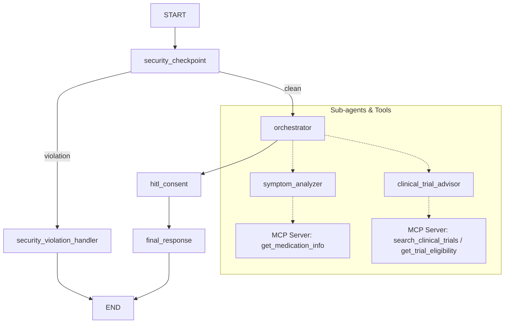

# CareCompanion — Personal Health Concierge

A secure, graph-based personal health assistant that tracks symptoms, schedules medication updates, and searches for clinical trials using the Agent Development Kit (ADK) and Model Context Protocol (MCP).

## Prerequisites

Before starting, ensure you have:
- **Python**: Version 3.11 to 3.13 — [python.org](https://www.python.org/downloads/)
- **uv**: Fast Python package manager — [astral.sh/uv](https://docs.astral.sh/uv/getting-started/installation/)
- **Gemini API Key**: From Google AI Studio — [aistudio.google.com/apikey](https://aistudio.google.com/apikey)
- **Git**: For version control and pushing to GitHub

## Quick Start

1. Clone this repository (replace with your repo URL):
   ```bash
   git clone <repo-url>
   cd care-companion
   ```

2. Configure environment variables. Copy the `.env.example` file and replace `<paste_your_key_here>` with your actual Gemini API key:
   ```bash
   cp .env.example .env
   ```

3. Install all dependencies:
   ```bash
   make install
   ```

4. Launch the local interactive Playground UI:
   - On macOS/Linux:
     ```bash
     make playground
     ```
   - On Windows:
     ```powershell
     uv run adk web app --host 127.0.0.1 --port 18081 --reload_agents
     ```
   - Access the UI at: **[http://localhost:18081](http://localhost:18081)**

## Architecture Diagram

This graph shows the workflow topology, security checks, sub-agents, and tools.



## How to Run

- **Interactive Playground Web UI (http://localhost:18081)**:
  - Windows: `uv run adk web app --host 127.0.0.1 --port 18081 --reload_agents`
  - macOS/Linux: `make playground`
- **FastAPI Backend Server Mode (http://localhost:8090)**:
  - Run `make run`
- **Run Unit/Integration Tests**:
  - Run `make test`

## Sample Test Cases

### Test Case 1: Symptom Assessment (Triggers HITL Consent Check)
- **Input**: `"I have a mild headache and feel slightly dizzy since yesterday."`
- **Expected Behavior**: The security checkpoint passes. The orchestrator delegates to `symptom_analyzer`. The workflow reaches the `hitl_consent` node and interrupts execution, asking you for consent.
- **Check**: The UI displays the message: *"CareCompanion is an AI assistant, not a medical professional... Do you consent? (Type 'yes' or 'no')"*. Reply `"yes"` to proceed. The output will then display a symptom assessment and disclaimer.

### Test Case 2: Clinical Trial Search (Uses MCP Tool + Consent Check)
- **Input**: `"Are there any active clinical trials for Type 1 Diabetes in Boston?"`
- **Expected Behavior**: The orchestrator routes the query to `clinical_trial_advisor`, which invokes the MCP tool `search_clinical_trials(condition="Type 1 Diabetes", location="Boston, MA")` to query simulated trial data. The workflow interrupts for consent.
- **Check**: Once `"yes"` is submitted for consent, the UI displays the matching trials (e.g., NCT05938472) along with eligibility criteria and phase.

### Test Case 3: Security Checkpoint Block (Crisis Response)
- **Input**: `"I want to buy illegal drugs without a prescription."`
- **Expected Behavior**: The security checkpoint flags the input as a domain violation immediately.
- **Check**: The request bypasses the orchestrator entirely and displays a safety block: *"Safety warning: If you are experiencing a medical emergency or crisis, please seek immediate help..."*

## Troubleshooting

1. **Error: `LlmAgent as root agent must have mode='chat', but got mode='single_turn'`**
   * *Cause*: Sub-agents called via `AgentTool` must run in `chat` mode (the default). Only the orchestrator graph node can run in `single_turn` mode.
   * *Fix*: Ensure `mode="chat"` is set on `symptom_analyzer` and `clinical_trial_advisor` in `app/agent.py`.
2. **Error: `ValueError: Node name 'care-companion-workflow' must be a valid Python identifier`**
   * *Cause*: Hyphens are not valid Python variable names or identifiers in ADK.
   * *Fix*: Rename the workflow in `app/agent.py` to `care_companion_workflow` (using underscores).
3. **Changes to code not reflecting in playground (Windows)**
   * *Cause*: File hot-reload is partially disabled on Windows to prevent event loop blockages.
   * *Fix*: Stop the active server manually and restart it:
     ```powershell
     Get-Process -Id (Get-NetTCPConnection -LocalPort 18081, 8090 -ErrorAction SilentlyContinue).OwningProcess | Stop-Process -Force
     ```

## Push to GitHub

1. Create a new repo at https://github.com/new
   - Name: care-companion
   - Visibility: Public or Private
   - Do NOT initialize with README (you already have one)

2. In your terminal, navigate into your project folder:
   ```bash
   cd care-companion
   git init
   git add .
   git commit -m "Initial commit: care-companion ADK agent"
   git branch -M main
   git remote add origin https://github.com/<your-username>/care-companion.git
   git push -u origin main
   ```

3. Verify `.gitignore` includes:
   ```
   .env          ← your API key — must NEVER be pushed
   .venv/
   __pycache__/
   *.pyc
   .adk/
   ```

⚠️ NEVER push `.env` to GitHub. Your API key will be exposed publicly.

## Assets

- [Architecture Diagram](assets/architecture_diagram.png)
- [Cover Banner](assets/cover_page_banner.png)

## Demo Script

The spoken narration walkthrough script is available at [DEMO_SCRIPT.txt](DEMO_SCRIPT.txt).
