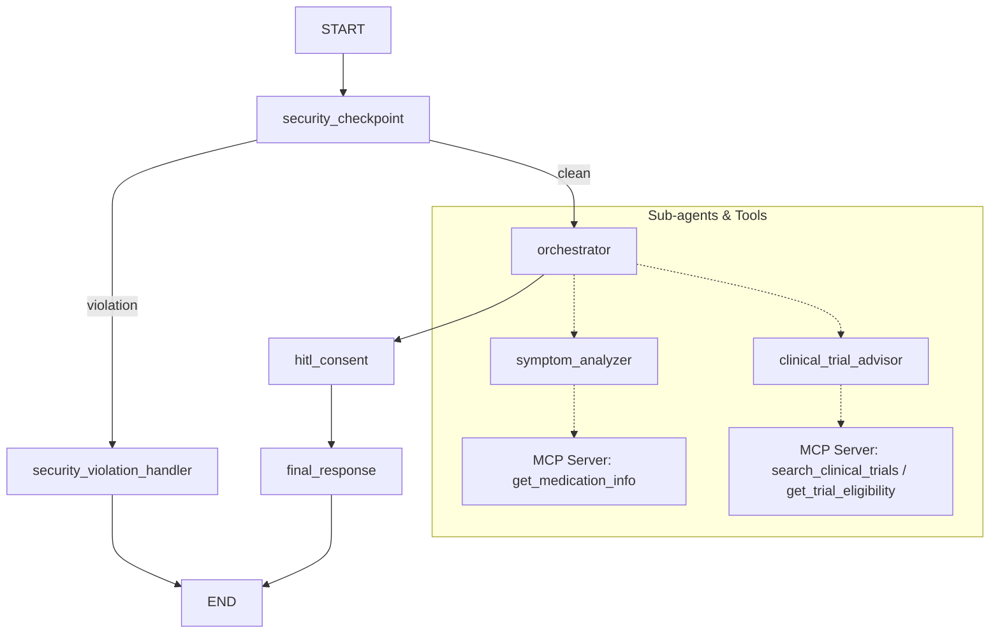

# Submission Write-Up — CareCompanion Health Concierge

## Problem Statement
Navigating personal healthcare (assessing symptom urgency, researching medication details, or identifying clinical trials) is often overwhelming and prone to misinformation. Users need a secure, guided personal assistant that respects safety boundaries, redacts personal information, uses validated local data tools, and pauses for explicit consent before processing health-related inputs. CareCompanion addresses this need by combining deterministic workflow gates with AI reasoning.

## Solution Architecture

## Concepts Used

1. **ADK Workflow**: Configured in [app/agent.py](file:///c:/Projects/Google%20x%20Kaggle/adk-workspace-prj/care-companion/app/agent.py#L250-L260). Establishes a graph layout (`care_companion_workflow`) that directs the execution path.
2. **LlmAgent**: Initialized for specialized tasks in [app/agent.py](file:///c:/Projects/Google%20x%20Kaggle/adk-workspace-prj/care-companion/app/agent.py#L137-L177) (`orchestrator`, `symptom_analyzer`, `clinical_trial_advisor`).
3. **AgentTool**: Declared in [app/agent.py](file:///c:/Projects/Google%20x%20Kaggle/adk-workspace-prj/care-companion/app/agent.py#L189-L190). Allows the lead orchestrator to delegate sub-tasks to specialists.
4. **MCP Server**: Defined in [app/mcp_server.py](file:///c:/Projects/Google%20x%20Kaggle/adk-workspace-prj/care-companion/app/mcp_server.py). Exposes specialized tools for clinical trials and medications.
5. **Security Checkpoint**: Implemented in [app/agent.py](file:///c:/Projects/Google%20x%20Kaggle/adk-workspace-prj/care-companion/app/agent.py#L35-L113) as the initial filter node (`security_checkpoint`).
6. **Agents CLI**: Utilized for project creation and local execution via `agents-cli scaffold` and `uv run adk web app`.

## Security Design

CareCompanion implements four distinct layers of safety controls:
* **PII Scrubbing**: Regular expressions match emails, phone numbers, and SSNs, redacting them immediately to protect user privacy.
* **Prompt Injection Detection**: Scans inputs for rule-override commands (e.g., `"ignore instructions"`, `"jailbreak"`) and routes them to a secure shutdown node.
* **Domain Safety Rules**: Explicitly blocks requests for unauthorized online drug purchases or queries expressing self-harm/suicide, replacing them with a helpful crisis guidance response.
* **Structured Auditing**: Every security decision is output in JSON format with clear severities (`INFO`, `WARNING`, `CRITICAL`) to allow easy production monitoring.

## MCP Server Design

The Model Context Protocol (MCP) server runs over stdio and exposes three health tools:
* `search_clinical_trials(condition, location)`: Finds relevant matching research trials from our secure mock database.
* `get_trial_eligibility(nct_id)`: Summarizes the key inclusion and exclusion criteria for a selected clinical trial.
* `get_medication_info(drug_name)`: Returns official dosage, class, precautions, and contraindications for a selected generic drug.

## Human-in-the-Loop (HITL) Flow

Medical queries require a responsible trust framework. CareCompanion uses the `RequestInput` node `hitl_consent` in the graph to check if the orchestrator output contains medical information (symptoms or clinical trials). If so, it interrupts execution and asks:
> *"CareCompanion is an AI assistant, not a medical professional... Do you consent to the storage of this query? (Type 'yes' or 'no')"*

The workflow pauses and waits. If the user replies `"yes"`, the workflow resumes and displays the results; if `"no"`, it prints a clean decline response without displaying diagnostic detail.

## Demo Walkthrough

The demo follows the three standard cases outlined in the [README.md](file:///c:/Projects/Google%20x%20Kaggle/adk-workspace-prj/care-companion/README.md):
1. **Symptom Assessment**: Shows how a query about dizzy symptoms gets assessed, and triggers the consent gate before revealing results.
2. **Clinical Trial Search**: Shows the advisor retrieving trials via the MCP tools and asking for consent to show details.
3. **Safety Block**: Shows the security checkpoint immediately blocking a request for self-harm or unauthorized purchases, routing to the safety handler.

## Impact & Value Statement

CareCompanion bridges the gap between raw medical databases and non-technical patients. By enforcing strict PII scrubbing, domain safety blocks, and a human-in-the-loop consent gate, it provides a safe, trusted, and reliable health concierge. Patients and caregivers benefit from structured, clear insights, while maintaining robust data privacy and crisis protection.
